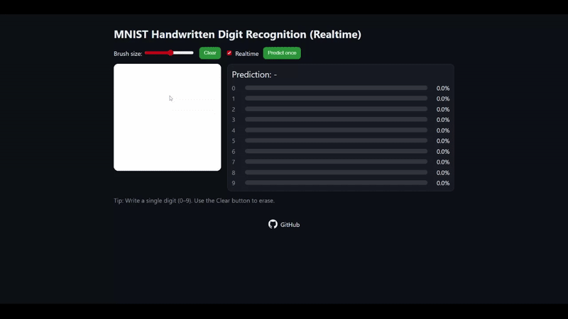

# MNIST Handwritten Digit Recognition - Flask + Realtime Canvas

[](https://www.python.org/)
[](https://www.tensorflow.org/)
[](https://flask.palletsprojects.com/)
[](LICENSE)
[](https://github.com/gbennnn/realtime-digit-recognition)

An interactive web application for recognizing handwritten digits using a CNN model trained on the MNIST dataset.  
Users can draw directly on a browser canvas, and the model will predict the digit in **realtime**.

## Preview
 

## Features
- **CNN model training** on the MNIST dataset.
- **Flask web application** with `/predict` endpoint for inference.
- **Interactive canvas** in the browser for drawing digits.
- **Realtime prediction** while drawing.
- **Preprocessing**: cropping, scaling, and padding to make input resemble MNIST format.

## Installation & Running

1. **Clone the repository**
    ```bash
    git clone https://github.com/gbennnn/realtime-digit-recognition.git
    cd realtime-digit-recognition
    ```

2. **Create a virtual environment & install dependencies**

    ```bash
    python -m venv .venv
    .venv\Scripts\activate  # Linux/Mac: source .venv/bin/activate
    pip install -r requirements.txt
    ```

3. **Train the model**

    ```bash
    python train_mnist.py
    ```

    This script will download the MNIST dataset, train the CNN, and save the model to `models/mnist_cnn.h5`.

4. **Run the web app**

    ```bash
    python app.py
    ```

    Open your browser at `http://127.0.0.1:5000`.

## Model Architecture

Simple CNN model:

1. Conv2D(32, kernel 3×3, ReLU) → MaxPooling2D
2. Conv2D(64, kernel 3×3, ReLU) → MaxPooling2D
3. Flatten → Dense(128, ReLU) → Dropout(0.3)
4. Dense(10, Softmax) for classifying digits 0–9.

Optimizer: **Adam**  
Loss: **SparseCategoricalCrossentropy**  
Accuracy on MNIST: ±98%.

## License

MIT License.  
Feel free to use, modify, and distribute this project.
