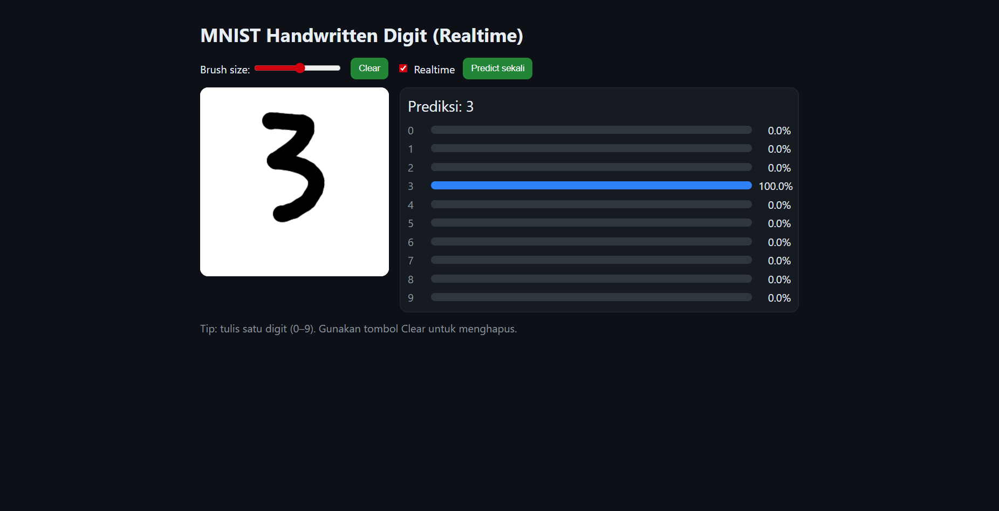

# MNIST Handwritten Digit Recognition - Flask + Realtime Canvas

[](https://www.python.org/)
[](https://www.tensorflow.org/)
[](https://flask.palletsprojects.com/)
[](LICENSE)
[](https://github.com/username/repository)

Aplikasi web interaktif untuk mengenali digit tulisan tangan menggunakan model CNN yang dilatih pada dataset MNIST.  
Pengguna bisa menggambar langsung di canvas browser, dan model akan memprediksi digit secara **realtime**.

---

## Preview
 

## Fitur
- **Training model CNN** pada dataset MNIST.
- **Aplikasi web Flask** dengan endpoint `/predict` untuk inferensi.
- **Canvas interaktif** di browser untuk menggambar digit.
- **Prediksi realtime** saat menggambar.
- **Preprocessing**: cropping, scaling, dan padding agar input lebih mirip format MNIST.

---

## Instalasi & Menjalankan

1. **Clone repository**
   ```bash
   git clone https://github.com/username/mnist-flask-app.git
   cd mnist-flask-app
   ```

2. **Buat virtual environment & install dependencies**

   ```bash
   python -m venv .venv
   .venv\Scripts\activate  # Linux/Mac: source .venv/bin/activate
   pip install -r requirements.txt
    ```

3. **Latih model**

   ```bash
   python train_mnist.py
   ```

   Script ini akan mengunduh dataset MNIST, melatih CNN, dan menyimpan model ke `models/mnist_cnn.h5`.

4. **Jalankan web app**

   ```bash
   python app.py
   ```

   Buka browser di `http://127.0.0.1:5000`.

---

## Arsitektur Model

Model CNN sederhana:

1. Conv2D(32, kernel 3×3, ReLU) → MaxPooling2D
2. Conv2D(64, kernel 3×3, ReLU) → MaxPooling2D
3. Flatten → Dense(128, ReLU) → Dropout(0.3)
4. Dense(10, Softmax) untuk klasifikasi digit 0–9.

Optimizer: **Adam**
Loss: **SparseCategoricalCrossentropy**
Akurasi pada MNIST: ±98%.

---


## Lisensi

MIT License.
Silakan gunakan, modifikasi, dan distribusikan proyek ini.
